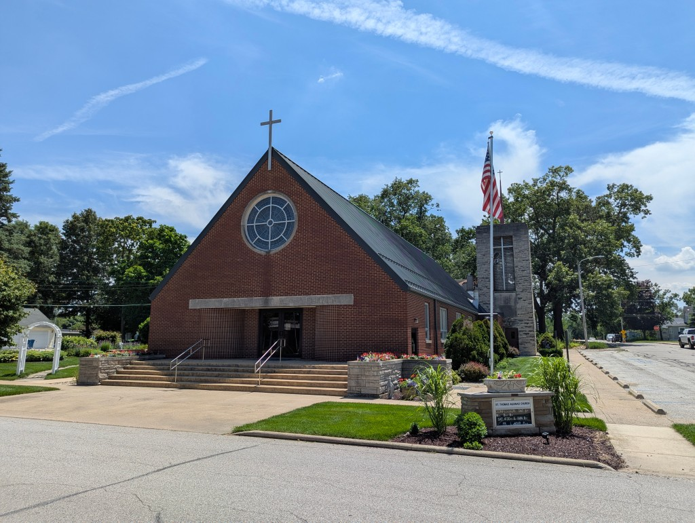

## Knox, IN

[Read the weekly bulletin here!](https://parishesonline.com/organization/st-thomas-aquinas-church-46534)
## Mass Schedule
### Sunday Masses
Saturday (anticipatory) | 4:30pm  
Sunday | 9:00am
### Weekday Masses
Mon, Tue, Thu, Fri | 8:00am  
Wed | 5:00pm (followed by *Fides,* adult faith formation)
## Sacraments & Sacramentals
### Confession
Saturday | 3:00–4:00pm or by appointment
### Eucharistic Adoration
1st Friday, after Mass  
1st Sunday, 8:00am
### Baptism, Matrimony, Anointing of the Sick
Please contact the parish office; for weddings, please contact us before scheduling a date
## Contact Info
St. Thomas Aquinas Catholic Church  
406 E Washington St.  
Knox, IN 46534  
(574) 772-4134  
[stthomasknox@outlook.com](mailto:stthomasknox@outlook.com)  
**Fr. Jordan Fetcko, Administrator**

**St. Vincent de Paul Help Line**  
(574) 806-0431
## Parish Staff
Administrator  
Rev. Jordan C. Fetcko  
[jfetcko@dcgary.org](mailto:jfetcko@dcgary.org)

Secretary  
Cathy Raab  
[stthomasknox@outlook.com](mailto:stthomasknox@outlook.com)

Director of Religious Education  
Catherine Phipps  
(219) 775-1355

***
*St. Thomas Aquinas Church is a registered 501(c)(3) non-profit organization. Goodstack charity ID: 0103048200*

*Mission statement: St. Thomas Aquinas Church is the Catholic community of Knox, seeking to proclaim the Gospel of Jesus Christ to Starke County and beyond by providing sacraments, opportunities for prayer and devotion, and faith formation to all who wish to grow in relationship with their Savior.*
